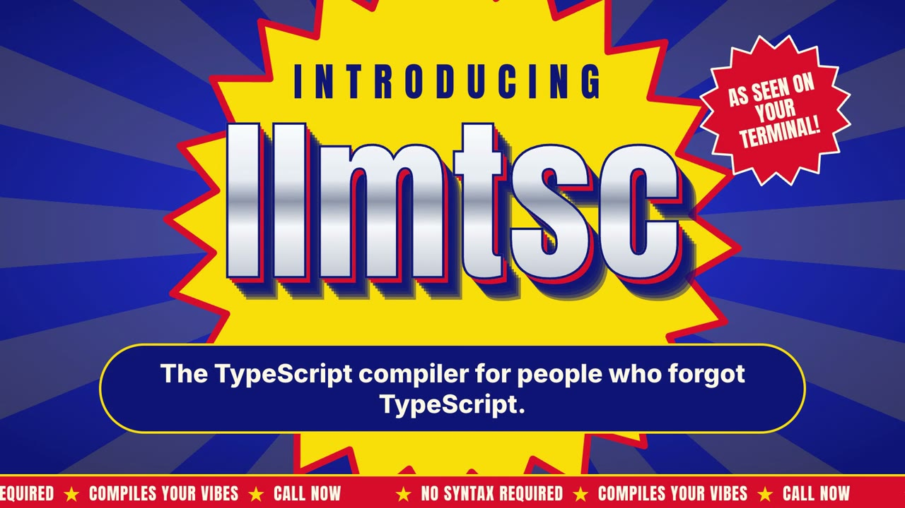

# llmtsc

[](media/llmtsc-infomercial.mp4)

<sub>▶ <a href="media/llmtsc-infomercial.mp4">Watch the infomercial</a> (71s, with sound). Forgot how to code? llmtsc compiles your vibes.</sub>

A TypeScript compiler front-end that **lets an LLM repair type errors, typos and syntax slips before transpiling**, so code with errors still compiles.

Your source files are **never modified**. llmtsc type-checks the project, asks the LLM for minimal fixes, keeps the repaired text in memory and hands *that* to the compiler or bundler. What's on disk stays exactly as you wrote it.

```
src/index.ts (on disk)                       what gets compiled
------------------------------------------   ------------------------------------------
import { User, fulName } from "./user";      import { User, fullName } from "./user";
{ id: "1", lastNme: "Turing" }               { id: 1, lastName: "Turing" }
return user.email.split("@")[1];             return user.email?.split("@")[1];
conole.log(users.lenght);                    console.log(users.length);
console.log("total", total;                  console.log("total", total);
```

It works with plain `tsc`-style builds, **React (Vite, webpack, CRA/craco, Next.js with webpack)**, **Angular (`ng build` / `ng serve`)**, Jest, ts-node, and any other Node-based tool.

## How it works

1. Build a TypeScript program from your `tsconfig.json`. Solution-style configs with `references`, as used by Vite and Angular, are followed.
2. Group the errors by file and send each broken file, with its diagnostics, to the LLM. The LLM answers with small `SEARCH/REPLACE` edits.
3. Apply the edits in memory and type-check again. A repair is kept only if it resolves at least one of the file's errors and does not add syntax errors. Otherwise it is thrown away.
4. Repeat up to `LLMTSC_MAX_PASSES` times (default 4). Fixing one error often reveals errors it was hiding, which is why there are several passes.
5. Compile or bundle the repaired text. Errors the LLM couldn't fix are reported the way `tsc` reports them.

Answers are cached on disk, keyed by file content, diagnostics and model, so rebuilds and CI runs only pay for files that changed.

## Install

```sh
npm i -D llmtsc
```

llmtsc uses your project's own `typescript` (version 5 or 6) so its diagnostics match your editor. TypeScript 7, the native Go port, no longer ships the JavaScript compiler API. In projects on TypeScript 7, llmtsc falls back to its own bundled TypeScript 6.

## Configure the LLM (environment variables)

| Variable | Meaning |
| --- | --- |
| `LLMTSC_PROVIDER` | `anthropic` (default), `openai`, `gemini`, `openrouter`, `groq`, `deepseek`, `mistral`, `ollama`, `lmstudio`, or `command`. If unset, it is picked from whichever key is present. |
| `LLMTSC_MODEL` | Model id. Defaults: `claude-opus-5-5` (anthropic), `gpt-5` (openai), `gemini-2.5-pro`, `qwen2.5-coder` (ollama), … |
| `LLMTSC_API_KEY` | API key. Falls back to `ANTHROPIC_API_KEY`, `OPENAI_API_KEY`, `GEMINI_API_KEY`, `OPENROUTER_API_KEY`, `GROQ_API_KEY`, … |
| `LLMTSC_BASE_URL` | Custom endpoint, for example a proxy, Azure, vLLM, or any OpenAI-compatible server. |
| `LLMTSC_COMMAND` | For `provider=command`: a shell command that gets the prompt on stdin and prints the answer, e.g. `claude -p`, `ollama run qwen2.5-coder`, `llm -m gpt-5` |
| `LLMTSC_EFFORT` | Anthropic effort level `low` / `medium` (default) / `high` / `xhigh` / `max` |
| `LLMTSC_MAX_PASSES` | Number of check → repair rounds (default 4) |
| `LLMTSC_CONCURRENCY` | How many files are repaired in parallel (default 4) |
| `LLMTSC_CACHE_DIR` | Cache location (default `node_modules/.cache/llmtsc`). Set to `off` to disable the cache. |
| `LLMTSC_DISABLE` | Set to `1` to skip the LLM; llmtsc then behaves like plain `tsc` |
| `LLMTSC_LOG` | `silent` / `error` / `info` (default) / `debug` |

Examples:

```sh
export ANTHROPIC_API_KEY=sk-ant-...                        # Claude (default)
export LLMTSC_PROVIDER=openai OPENAI_API_KEY=sk-...        # OpenAI
export LLMTSC_PROVIDER=ollama LLMTSC_MODEL=qwen2.5-coder   # local, no key
export LLMTSC_COMMAND="claude -p"                          # reuse a CLI you're already logged into
```

## Usage

### 1. As a `tsc` replacement

```sh
npx llmtsc                    # like `tsc`: reads tsconfig.json, emits to outDir
npx llmtsc -p tsconfig.build.json --outDir out
npx llmtsc --watch
npx llmtsc check              # only show what would be repaired (diff), emit nothing
npx llmtsc --show-fixes       # compile and print the diff of every repair
npx llmtsc --no-llm           # plain tsc
npx llmtsc file.ts            # compile single files, no tsconfig needed
npx llmtsc run file.ts [args] # repair, compile and execute a script (like ts-node / tsx)
```

Every `tsc` flag is accepted. The exit codes are the same as `tsc`: `0` means success, `2` means errors remain but output was emitted, `1` means nothing was emitted.

### 2. Any build tool: `llmtsc run -- <command>`

Note the `--`. `llmtsc run file.ts`, without `--`, compiles and executes that one file instead.

This wraps any Node-based tool. llmtsc repairs the project first and then starts the command with a small preload hook. When the tool reads a broken `.ts` file through Node's `fs`, the hook returns the repaired version instead.

```jsonc
// package.json
"scripts": {
  "build": "llmtsc run -- ng build",
  "start": "llmtsc run --watch -- ng serve",
  "test":  "llmtsc run -- jest"
}
```

With `--watch`, llmtsc watches your sources. When you save a broken file, the dev server first rebuilds with the broken text. As soon as the repair is ready, llmtsc touches the file and the dev server rebuilds and reloads with the fixed code.

### 3. Vite (React, Vue, Svelte, Solid, …)

```ts
// vite.config.ts
import { defineConfig } from "vite";
import react from "@vitejs/plugin-react";
import llmtsc from "llmtsc/vite";

export default defineConfig({
  plugins: [llmtsc(), react()],          // options: { tsconfig?: "tsconfig.app.json", root?: "..." }
});
```

This works for both `vite build` and `vite dev`. In dev mode, edits are repaired on the fly. When a change in one file changes the repair of another file, for example after a renamed export, Vite reloads the affected modules.

### 4. webpack / rspack (CRA via craco, Next.js `webpack()`, custom setups)

Put the loader **last** in `use`. Loaders run right to left, so the last one runs first:

```js
{
  test: /\.tsx?$/,
  use: ["babel-loader", "llmtsc/webpack-loader"],   // or ts-loader { transpileOnly: true }, swc-loader, esbuild-loader
}
```

`ts-loader` without `transpileOnly` type-checks the other files by reading them from disk itself, so it still sees their original errors. In that case use `transpileOnly: true` or `llmtsc run -- webpack`.

### 5. Programmatic API

```ts
import { LlmFixer } from "llmtsc";

const fixer = new LlmFixer({ cwd: process.cwd(), tsconfig: "tsconfig.json" });
await fixer.ensureFresh();
const fixed = await fixer.getFixedText("src/index.ts"); // undefined if the file needed no repair
for (const [file, text] of fixer.getFixes()) { /* ... */ }
```

## Framework notes

- **React + Vite**: use the Vite plugin. esbuild and SWC skip type-checking, so without llmtsc a typo like `conole.log` would only fail at runtime. With llmtsc it is repaired at build time.
- **Angular**: use `llmtsc run -- ng build` / `llmtsc run --watch -- ng serve`. This was tested with the Angular 20 esbuild builder. llmtsc repairs TypeScript errors only. Errors inside component **HTML templates** are reported by Angular's template compiler, and llmtsc does not fix them.
- **Next.js**: the webpack loader works with `next build --no-turbopack` / `next dev` with webpack. Turbopack reads files from Rust, so neither the loader nor the `run` hook can reach it.
- **Tools that don't read files through Node**, such as the standalone esbuild/swc/Bun/Deno CLIs, can't be intercepted. For those, run `llmtsc` as the compiler instead.

## Caveats

- An LLM's repair is a **guess** about what you meant. Use `llmtsc check` or `--show-fixes` to see exactly what was changed, and fix the real source when you get the chance. llmtsc keeps broken code building; it doesn't replace fixing it.
- Your source code is sent to the configured LLM provider. Use a local model (`ollama`, `lmstudio`, or `command`) if that's not acceptable.
- Source maps point to the repaired text. The edits are kept small, so line numbers almost always still match.

## Development

```sh
npm install
npm test        # builds and runs an offline test-suite (uses a deterministic mock LLM)
```

The `examples/` folder has a plain `tsc` project, a React + Vite app, and a webpack setup, each with deliberate errors.
